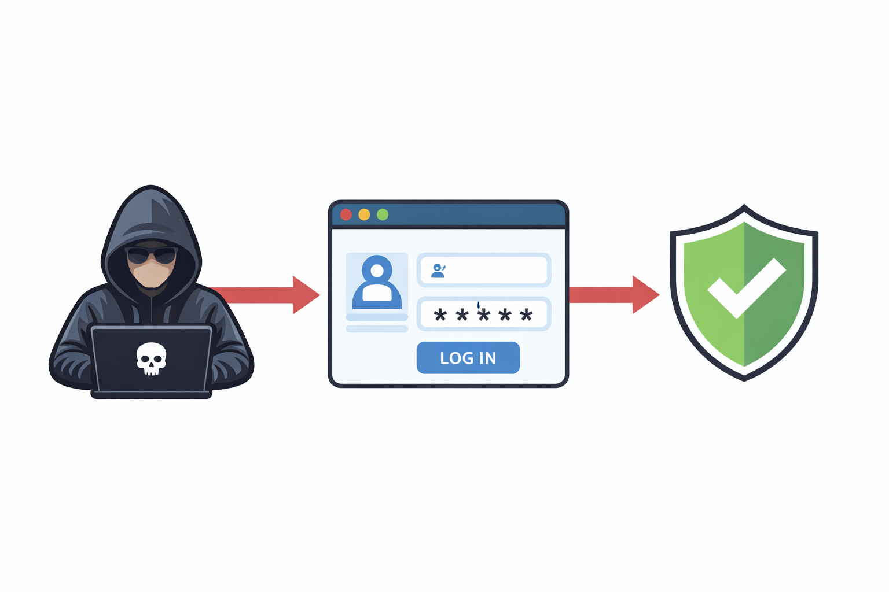

# Brute Force Login Defense Lab (Flask + Docker)

A practical cybersecurity lab demonstrating **how a brute force login attack works** and how to mitigate it using **rate limiting and temporary IP blocking**.

This lab follows the **Attack → Detect → Defend** approach.

## Scenario

A SaaS login application is targeted by automated login attempts trying multiple passwords using a dictionary based brute force attack.

Our task is to simulate the attack and implement defenses to stop it.

## Architecture



## Setup

Clone the repository and start the lab environment:

```bash
docker compose up --build
```

The login application will run at:

```
http://localhost:5000
```

## Run the Attack

Enter the attacker container:

```bash
docker exec -it brute_attacker bash
```

Run the brute force script:

```bash
python brute_force_attack.py
```

## Enable defense

Activate security in the ```app.py```:

```python
ACTIVATE_SECURITY = True
```

Run the attack again to observe the defense.

## Detection

Monitor authentication logs:

#### On Linux/MacOS:

```bash
tail -f logs/auth.log
```

#### On Windows (Powershell):

```powershell
Get-Content -Path "logs\auth.log" -Wait
```

Example output:

```bash

2026-03-05 12:51:10,002 | WARNING | [AUTH_FAIL] | IP=[REDACTED] | USERNAME=admin
2026-03-05 12:51:10,012 | WARNING | [AUTH_FAIL] | IP=[REDACTED] | USERNAME=admin
2026-03-05 12:51:10,012 | WARNING | [IP_BLOCKED] | IP=[REDACTED]

```

## Learning Outcome

This lab demonstrates:

- how brute force login attacks work
- how to detect repeated authentication attempts
- how rate limiting and IP blocking mitigate attacks

## Next Lab

This defense can be bypassed using **IP rotation attacks**.

The next lab demonstrates **defending against distributed brute force attempts**.

## Author

Mukul Chauhan
*Resonanex Labs*

Full explanation available in the website article.

Checkout the Youtube Video below.